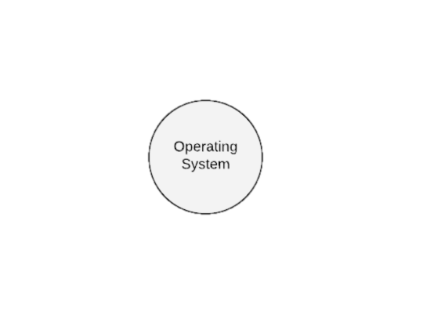
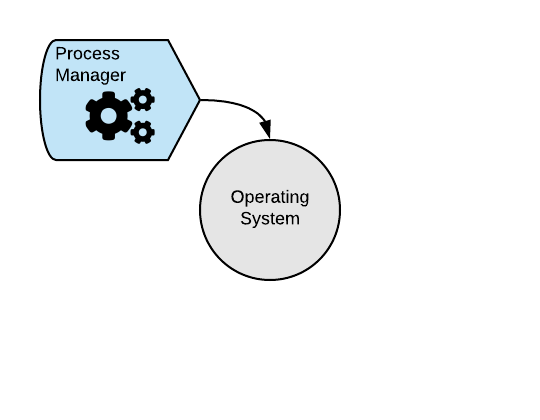
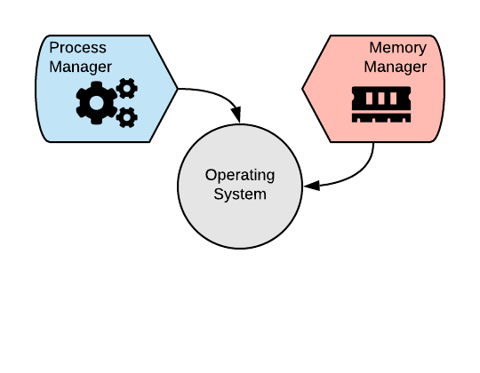
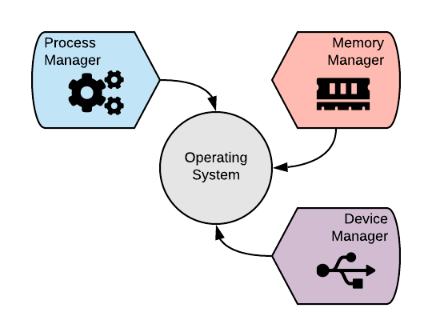
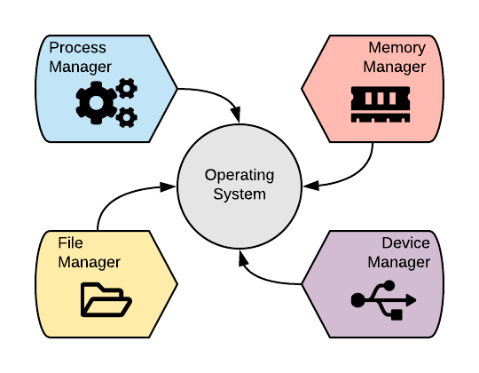

## Sistemas Operativos

Un sistema operativo es un conjunto de programas que se encarga de gestionar y administrar los recursos de hardware.

Entre los recursos se encuentran:
@ol
* Memoria principal (asignación y liberación de memoria)
* Memoria secundaria (administrar los archivos)
* CPU (ejecución de instrucciones, manejo de programas)
* Puertos I/O
@olend

+++?color=linear-gradient(0deg, white 20%, grey 80%) 
# Qué administra un sistema operativo moderno?

+++?color=linear-gradient(0deg, white 40%, grey 60%)
@snap[east span-60]

@snapend
+++?color=linear-gradient(0deg, white 40%, grey 60%)
@snap[east span-60]

@snapend
+++?color=linear-gradient(0deg, white 40%, grey 60%)
@snap[east span-60]

@snapend
+++?color=linear-gradient(0deg, white 40%, grey 60%)
@snap[east span-60]

@snapend
+++?color=linear-gradient(0deg, white 40%, grey 60%)
@snap[east span-60]

@snapend