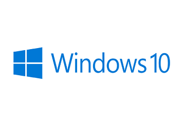
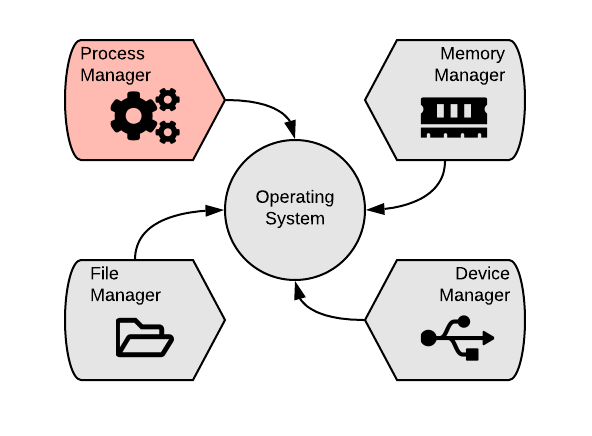
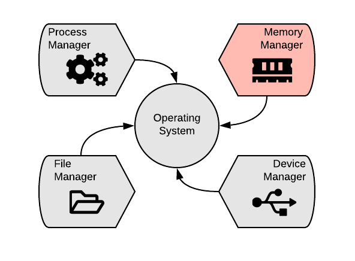
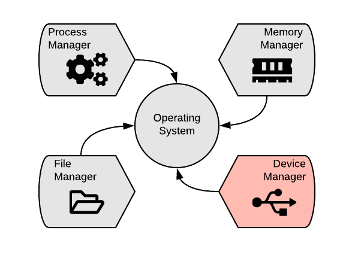
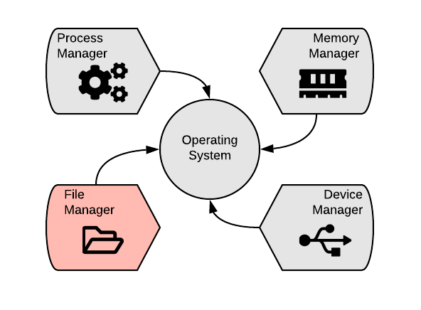

## Sistemas Operativos
@ul
* ¿Puedes nombrar 5?
@ulend

+++
@snap[north-east]

@snapend

@snap[north-west]

@snapend

@snap[south-east]

@snapend

@snap[south-west]

@snapend

@snap[mid-east]

@snapend

+++
@snap[text-left]
## Sistemas Operativos
Un sistema operativo es un conjunto de programas que se encarga de gestionar y administrar los recursos de hardware.

Entre los recursos se encuentran:
@ul[text-08]
* @css[text-pink](Memoria principal [asignación y liberación de memoria])
* @css[text-pink](Memoria secundaria [administrar los archivos])
* @css[text-pink](CPU [ejecución de instrucciones, manejo de programas])
* @css[text-pink](Puertos I/O)
@ulend
@snapend

+++?color=linear-gradient(90deg, white 50%, yellow 50%) 
@snap[north-west span-45 text-07 text-left]
@css[text-bold text-blue](Sistemas Operativos Tradicional)
@css[text-bold text-blue](Traditional OS)
@ol[text-08]
* Se especializan en poder realizar muchas tareas al mismo tiempo (multitasking).
* Maneja poca información de múltiples fuentes.
* No son mission-critical. No importa si se atrasan algunas tareas.
* Los encontramos en tablets, celulares, computadoras.
@olend

@snapend
@snap[south-west span-45]

@snapend

@snap[north-east span-45 text-07 text-left]
@css[text-bold text-blue](Sistemas Operativos de Tiempo Real)
@css[text-bold text-blue](RTOS - Real Time OS)
@ol[text-08]
* Se especializan en rapidez de respuesta.
* Maneja mucha información de pocas fuentes.
* Se utilizan en aplicaciones médicas, militares y de procesamiento muy específico.
@olend
@snapend

@snapend
@snap[south-east span-45]

@snapend

+++?color=linear-gradient(to left, #4CA1AF, #C4E0E5)
### ¿Qué administra un sistema operativo moderno?

+++?color=linear-gradient(to left, #4CA1AF, #C4E0E5)

+++?color=linear-gradient(to left, #4CA1AF, #C4E0E5)
@transition[none]
@snap[east span-60]

@snapend
@snap[north-west span-50]

#### Administrador de Procesos
@ul[text-06 text-left]
* El administrador de procesos es el encargado de definir @css[text-pink](el orden) en el que se ejecutan las tareas del sistema.
* Ordena y ejecuta las tareas por @css[text-pink](prioridades).
    - @fa[mouse-pointer] 
    - @fa[youtube]
    - @fa[video]
    - @fa[wifi]
    - @fa[chrome]
    - @fa[music] 
@ulend
@snapend

+++?color=linear-gradient(to left, #4CA1AF, #C4E0E5)
@transition[none]
@snap[east span-60]

@snapend

@snap[north-west span-45]
#### Administrador de Memoria
@ul[text-06 text-left]
* Es el encargado de asignar la @css[text-pink](memoria RAM) necesaria a cada uno de los procesos.
* Como la memoria es un recurso @css[text-pink](finito), es necesario poder asignar y liberarla de acuerdo con la demanda.
* Además, hay que administrarla de manera @css[text-pink](inteligente).
    * Copy paste? @fa[copy] @fa[paste]
@ulend
@snapend

+++?color=linear-gradient(to left, #4CA1AF, #C4E0E5)
@transition[none]
@snap[east span-60]

@snapend

@snap[north-west span-45]
#### Administrador de Dispositivos
@ul[text-06 text-left]
* El el @css[text-pink](traductor) entre cada dispositivo de hardware y el sistema operativo.
* Utiliza @css[text-pink](drivers) para poder comunicarse efectivamente.
* Algunos sistemas utilizan drivers genéricos, como @css[text-pink](HID - Human Interface Device).
    * @fa[usb] 
    * @fa[headphones-alt]
    * @fa[tv]
@ulend
@snapend

+++?color=linear-gradient(to left, #4CA1AF, #C4E0E5)
@transition[none]
@snap[east span-60]

@snapend

@snap[north-west span-45]
#### Administrador de Archivos
@ul[text-06 text-left]
* Este administrador se encarga de @css[text-pink](controlar el acceso) a los archivos.
* Genera y @css[text-pink](mantiene organizada) la información en la memoria secundaria.
* Nos da herramienta para que podamos @css[text-pink](visualizar) la información.
    * @fa[folder] 
    * @fa[file-word] 
@ulend
@snapend

+++?color=linear-gradient(to left, #4CA1AF, #C4E0E5)
@transition[none]
