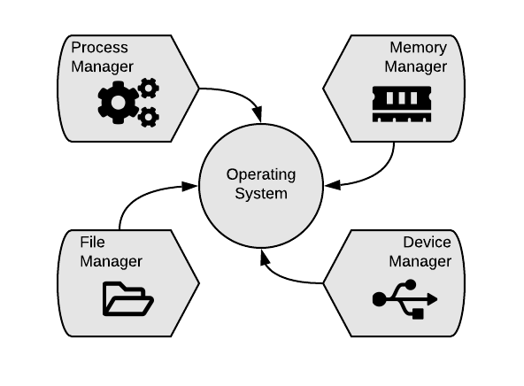

## Sistemas Operativos

Un sistema operativo es un conjunto de programas que se encarga de gestionar y administrar los recursos de hardware.

Entre los recursos se encuentran:
@ol
* Memoria principal (asignación y liberación de memoria)
* Memoria secundaria (administrar los archivos)
* CPU (ejecución de instrucciones, manejo de programas)
* Puertos I/O
@olend

+++?color=linear-gradient(0deg, white 20%, grey 80%) 
# Qué administra un sistema operativo moderno?

+++?color=linear-gradient(90deg, grey 40%, white 60%)

+++?color=linear-gradient(to left, #4CA1AF, #C4E0E5)
@transition[none]
@snap[east span-60]

@snapend
@snap[west span-50]
### Process Manager
#### Administrador de Procesos
@ul[text-08]
* El administrador de procesos es el que define el orden en el que se ejecutan las tareas del sistema.
* Ordena y ejecuta las tareas por prioridades.
    * @fa[mouse-pointer]
    * @fa[youtube]
    * @fa[webcam]
    * @fa[wifi]
    * @fa[chrome]
    * @fa[music] 
@ulend
@snapend

+++?color=linear-gradient(90deg, grey 60%, white 40%)
@transition[none]
@snap[east span-60]

@snapend

+++?color=linear-gradient(90deg, grey 60%, white 40%)
@transition[none]
@snap[east span-60]

@snapend