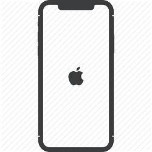

## Introducción a la Informática
¿Qué es una computadora?
---
@snap[north-west] 
 
@snapend

@snap[north] 
 
@snapend
@snap[north-east] 
 
@snapend
@snap[east] 
 
@snapend
@snap[west]
 
@snapend
@snap[south-west] 
 
@snapend
@snap[south-east] 
 
@snapend
@snap[south] 
 
@snapend

---
@snap[west span-30]
## ¿Qué es una computadora?
@snapend

@snap[north-east span-40 fragment] 
@box[bg-purple text-white box-narrow-padding](Step 1.#¿Qué es?) 
@snapend

@snap[east span-40 fragment] 
@box[bg-orange text-white box-narrow-padding](Step 2.#¿Qué hace?) 
@snapend

@snap[south-east span-40 fragment] 
@box[bg-pink text-white box-narrow-padding](Step 3.#¿Cómo lo hace?) 
@snapend

---
